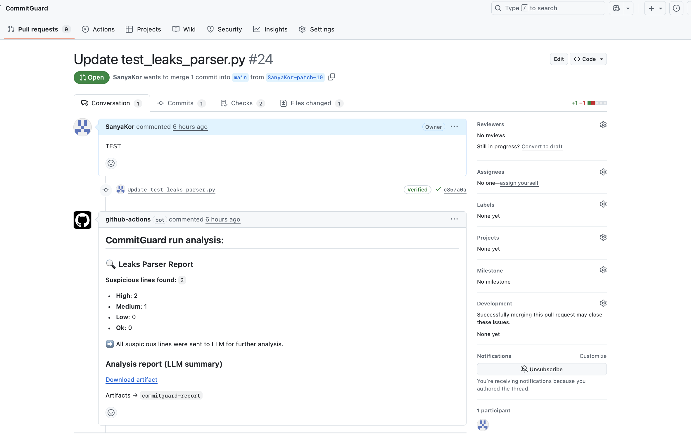

# CommitGuard

CommitGuard is a PR-focused security scanner that automatically analyzes Pull Requests for leaked secrets and insecure changes. It inspects the PR’s commits/diff for hardcoded credentials (API keys, tokens, passwords, private keys) and risky configurations (e.g., disabled TLS verification), then posts a structured report back to the PR.

The analysis can be LLM-assisted via LangChain (OpenAI or other providers) to classify findings into risk levels (CRITICAL/HIGH/MEDIUM/LOW) and generate concise explanations and evidence.

---

## Requirements

- Python **3.12+**

Install dependencies and the tool locally:

```bash
pip install -r requirements.txt
pip install -e .
```


## Usage 

## 🚀 Use CommitGuard on Pull Requests

It scans PR commits/changes for: - API keys and tokens - passwords and
credentials - private keys - insecure configurations
(e.g. `verify=False`, `--insecure`)

Findings can be classified by an LLM (via LangChain) into severity
levels: ** HIGH / MEDIUM / LOW**.


CommitGuard is designed to run automatically via GitHub Actions.

### 1. Fork the repository

Fork this repository.

### 2. Add required secrets

In your forked repository:

**Settings → Secrets and variables → Actions → New repository secret**

Add the following secrets:

#### `GH_PAT` --- GitHub Fine-grained Personal Access Token

Used to read commit data (and private repos if needed).

Recommended permissions: - Contents: Read - Pull requests: Read

#### `OPENAI_API_KEY` --- OpenAI API key

Used for LLM-based risk classification.

> If you use another LLM provider (Ollama, Azure, etc.), configure the
> corresponding environment variables instead.

------------------------------------------------------------------------

### 3. Add GitHub Actions workflow

Create file:

    .github/workflows/pr-automation.yml

with the following content:

``` yml
name: PR Automation

on:
  pull_request:
    types: [opened, synchronize, reopened, ready_for_review]

permissions:
  issues: write
  pull-requests: write
  contents: read

jobs:
  bot:
    name: Run CommitGuard
    runs-on: ubuntu-latest
    steps:
      - name: Run CommitGuard on PR
        uses: Test/CommitGuard@v1
        with:
          github-token: ${{ secrets.GITHUB_TOKEN }}
        env:
          OPENAI_API_KEY: ${{ secrets.OPENAI_API_KEY }}
          GH_PAT: ${{ secrets.GH_PAT }}
```

------------------------------------------------------------------------

### 4. Open or update a Pull Request

On every PR update CommitGuard will automatically:

-   analyze PR commits and changes
-   detect leaked secrets and insecure configs
-   classify findings by severity
-   post a comment with results in the PR
-   upload full JSON report as workflow artifact

No manual steps are required.

Example: 




## CLI usage

Run via CLI:.

```bash
commitguard --repo <GITHUB_REPO_URL> --n <NUMBER_OF_COMMITS> --out <OUTPUT_JSON_FILE_NAME>
```

### Arguments
- `--repo` — GitHub repository URL (HTTPS or SSH)
- `--n` — number of commits to fetch (1–100)
- `--out` — Output json file name(default - suspicious_commits.json)
---

### Usage Examples

** Scan the last 5 commits of a repo via HTTPS**
```bash
commitguard --repo https://github.com/owner/repo.git --n 5 --out output.json
```

## Output
### JSON Logs

- Suspicious findings are reported with counts of **HIGH**, **MEDIUM**, and **LOW** threats.  
- Results are saved to `suspicious_commits.json`, including:  
  - code line  
  - file + line location  
  - commit metadata  
  - risk level (LLM)  
```bash
[
  {
    "line": "password = \"supersecret123\"",
    "location": "app/config.py:42",
    "author": "octocat",
    "date": "2025-09-30T12:00:00Z",
    "commit_message": "fix db connection",
    "llm_response": "HIGH: hardcoded password",
    "commit_sha": "xxxxxxxxxxxxxxxxxxxxxx"
  }
]
```


### Notes

This program requires a valid GitHub API key AND LLM key(openai), dont forget to set your own personal access token as an environment variable:

```bash
export GH_PAT="your_personal_access_token_here"
export OPENAI_API_KEY=sk-...
```

---
## LLM Configuration (pluggable via LangChain)

CommitGuard uses LangChain, so you can plug **any chat model** with a LangChain wrapper:
OpenAI, Ollama, AnthropicLLM, ... etc.

### Quick switch (env-based)
Set API key via env:
```bash
export OPENAI_API_KEY=sk-...
```

## Tests

CommitGuard includes a test suite to validate core functionality:
- GitHub API auth
- Commit fetching (sync/async)
- Leak parser (regex, test context, entropy)
- TODO: LLM integration flow

Run tests with:

```bash
pytest -v
```


---

## Further Development
Planned improvements and next steps for CommitGuard:

- Expand leak parser rules with more patterns (cloud provider keys, OAuth tokens, etc.)  
- Refine entropy-based detection to reduce false positives  
- Optimize LLM integration (batch processing, better scoring, MCP, data vectorisation + db hosting(chroma))  
- Add more tests for leak parser and LLM workflow   


